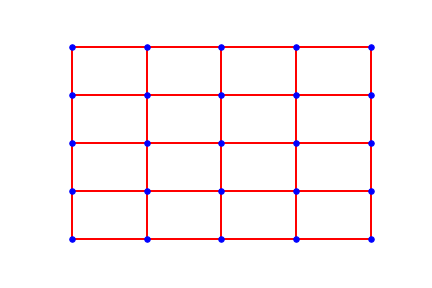
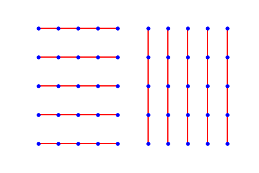
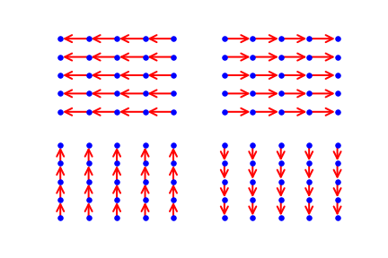

# How to choose the image’s symmetries with graph neural network

Symmetries are present naturally present in images. From two similar objects appearing in different locations to different point of view. This level of symmetries makes the correlation 

To exploit those symmetries people have apply transformations to the input image. Newly created synthetic images have the property of still belonging to the original class. While those images might seem obviously the same for humans, for CNN they appear as quite different ones. This allows the network to learn news features extractor and perform better on images close to transformed one. Depending on the dataset typical transformation include but are not limited to  random rotations,cropping, illuminance variation and resizing. This technique called “Data Augmentation” has been shown to help CNN to better generalization.

But creating those artificial data introduce a lot of correlation into the wights learned during training. What if you could exploit those symmetry in a smarter way and build them directly into the network ? What if the network you design could react in a predictable way when faced with transformed data? This property is what we call equivariance. In the case of CNN equivariance to translation allows weight sharing and has been shown to help a lot. Recently Cohen, has shown that you can design network equivariant to any transformation from any group. In his implementation the weights of the filter are shared with 90 degree rotations versions of the input. As an illustration of the utility, the network will have to learn only one edge detector, while a standard CNN would have to learn two vertical and two horizontal ones.

So far equivariance seems to be an interesting property to have. In order to achieve it, Risi and Shubhendu proved that convolution is not only sufficient but necessary as well.

Coming from all that background, we want to check which symeties is worth exploiting. We conducted an experience on two different datasets, CIFAR-10 and AID (satellite images). The first one is under the effect of gravity while the other one seems anisotropic (does not depend on direction). Those dataset are a good fit to check different network with different build in symmetries.

To exploit the symmetries, we works on graph where convolution is invariant to permutation of neighbouring nodes. Network we design will have invariance property to different transformation depending on the underlying graph we use. We present here the different underlying graph we used and explain their group symmetry.

First graph, the 2dGrid graph is the simplest regular graph defined on the plane. It's undirected edges gives him multiple symmetries. The ones we are interested in are: rotation of 90 degrees and mirroring.

The second kind of graphs are undirected vertical or horizontal edges. The symmetries found here are vertical and horizontal flips.

 

Last type of graphs are simple directed graph. Those graph doesn’t contain any symmetry but allow the information to flow across the image when combined with other graphs.

Different combination of those graph allows the convolution to be invariant to different symmetries. Therefor 
