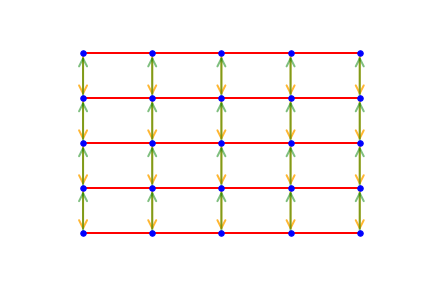

## Motivation

<figure style="width: 100px" class="align-right">
     
     <figcaption>Credits: <a href="http://pngimg.com/download/1065">pngimg</a></figcaption>
</figure>

Symmetries are naturally present in images. Look at butterflies for example, where an axial symmetry is clearly visible. Same object seen from other orientations appears to be symmetrical as well. While some symmetries are quite easy to detect, some are often hidden. What if we could find or at least check their presence in datasets? This blogpost provides the reader with a [framework](https://github.com/cgallay/GraphSymmetries/) that aims at testing the existence of those hidden symmetries in data. We showed that by exploiting the knowledge of true symmetries residing in images, we can apply an appropriate strategy that does in fact improve accuracy. As frequently shown in machine learning, having some insights of your dataset has gives some advantages.
{: .text-justify}

## Exploiting Symmetries

To take advantage of those symmetries, people usually apply transformations to the input images. Newly derived images are similar enough to belong to the original class. While the information contained in those transformed images might seem quite redundant to humans, they appear different to CNN. This allows the network to be able to extract new relevant features and  leads to better performance when applied to images close to transformed ones. Depending on the dataset, typical transformations include but are not limited to random rotations, cropping, illuminance variation and resizing. This technique, known as [Data Augmentation](https://medium.com/nanonets/how-to-use-deep-learning-when-you-have-limited-data-part-2-data-augmentation-c26971dc8ced), has shown to help CNN to better generalize.
{: .text-justify}

<figure style="width: 200px" class="align-right">
     
    <figcaption>Figure 1: Example of filters learned by a standard CNN. Note that some filters learned are rotation of other ones.
 Credits: Stanford's <a href="http://cs231n.stanford.edu/">CS 231N course</a></figcaption>
</figure>

But creating artificial data introduces a lot of correlation among the weights learned during training. What if we could exploit those symmetries in a smarter way and build them directly into the network ? What if the network we design could react in a predictable way when faced with transformed data? This property is what we call equivariance. Classical CNN are translation equivariant, which allows for weight sharing. It has shown to help a lot the network to learn filters that can be shared across locations, therefore removing the need of learning the same filters for different locations. Recently [Taco Cohen](https://github.com/tscohen/GrouPy), has demonstrated that you can design networks equivariant to any transformation from any [compact group](https://en.wikipedia.org/wiki/Compact_group). In his implementation, the weights of the filter are shared among all 90 degrees rotations of an image. As an illustration of utility, the network would have to learn one edge detector only, while a standard CNN would have to learn two vertical and two horizontal ones (See Figure 1).
{: .text-justify}

This equivariance to rotation achieved, by Taco Cohen, with his group convolution has been proved, by Risi and Shubhendu, to be the only way to get equivariance.
{: .text-justify}

> “Convolutional structure is not just a sufficient, but
also a necessary condition for equivariance to the
action of a compact group.” - [Risi and Shubhendu](https://arxiv.org/abs/1802.03690)

For the following, we build networks that are invariant to some symmetries. Invariance being a special case of equivariance where the output doesn’t change at all. To do that, we will still perform convolution, as it as proven to be necessary, but this time defined on graph.
{: .text-justify}

## Grid Graph symmetries

<figure class="half">
    
    
    <figcaption>Figure 2: Example of two isomorphic graphs.   Credits: <a href="https://en.wikipedia.org/wiki/Graph_isomorphism">Wikipedia</a></figcaption>
</figure>

### Invariance in graphs
Some domain like graphs, filter learned by convolutions are by construction [isotropic](https://en.wikipedia.org/wiki/Isotropy). Basically, in those spaces there is no notion of ordering. In the graph domain each node has a set of neighbouring nodes, but there is no way to tell from those nodes which one is located left or right. Those notion simply doesn’t exist. This is important to consider when designing a network to work on graph data. A reordering of the node (or renaming) doesn’t change the graph. When this is the case we say that graphs are isomorphic to each other (See Figure 2). We want two isomorphic graphs to have the exact same output when evaluated by a [Graph Convolutional](https://tkipf.github.io/graph-convolutional-networks/) Neural Network (GCNN). This impose GCNN to be invariant to permutation of the neighbouring nodes. In our case, working with 2dGrid graph, this translate into invariance to rotation and mirroring as shown below. Note that convolution on graph are location equivariant, which when working with images result into translation equivariance.
{: .text-justify}

### Underlying graphs
The network we design have an invariance property to different transformations depending on the underlying graph we use. We present here, the different ones we designed and explain their group symmetries.
{: .text-justify}



<figure style="width:250px; margin-top:-20px; margin-bottom:0px" class="align-left">
  
    <figcaption>Figure 3: Click to zoom.</figcaption>
</figure>

By concatenating the outputs of the convolution applied on those different underlying graphs, we can build networks that are invariant the desired symmetries only. For example, in the case of the graph in figure 3, we have a GCNN that is only invariant to horizontal mirroring.
{: .text-justify}

 

## Experimentation

<figure class="align-right" style="width: 325px">
<table class="sortable">
 <caption>Validation Accuracy</caption>
<thead> <tr> <th>Symmeties</th> <th>CIFAR-10</th> <th>AID</th> </tr></thead>
<tbody>
     <tr> <td>All (2dGrid)</td><td>52.9%</td> <td>70.4%</td> </tr>
     <tr> <td>Vertical</td><td>57.8%</td><td>-</td> </tr>
     <tr> <td>Vertical+Horizontal</td><td>60.5%</td> <td>67.5%</td> </tr>
     <tr> <td>Horizontal</td><td>64.3%</td><td>-</td> </tr>
     <tr> <td>None (Directed)</td><td>66.6%</td><td>68.5%</td> </tr>
</tbody></table>
<figcaption>Table 1: 
On CIFAR-10 training was performed with 20% of the dataset and models of roughly 52’000 parameters. While on AID training was performed with 20% of the dataset downsized to a shape of 200x200 pixels and models of roughly 107’000 parameters.</figcaption>
</figure>

### Datasets
Coming from all that background, we want to check which symmetries is worth exploiting. We conducted an experience on two different datasets for a classification task, [CIFAR-10](https://www.cs.toronto.edu/~kriz/cifar.html) and [AID](https://arxiv.org/abs/1608.05167) (satellite images). The first one is under the effect of gravity while for the other one the orientation of the images is arbitrary. Those datasets are a good fit to check invariance build into networks as we expect them to possess different types of symmetries. We will check for them below.
{: .text-justify}

### Test on CIFAR10

By looking at the result (See table 1), we deduce that apart from horizontal symmetries being invariant to other ones, badly affects the accuracy. It might be explained by the fact that gravity plays an important role in natural images, therefore you usually don't have vertical symmetries. On the other hand, it is often the case that you find horizontal symmetries in the natural world.
{: .text-justify}

### Test on AID

Compared to CIFAR-10, we see that, independently of the network architecture, results are quite the same. Convolving on 2d grid graph gives slightly better results than others graphs. This shows that rotation invariance for that kind of data is interesting to take into account when building the network. The reason might be again due to the nature of the data. As AID images are taken from an above point of view, any rotation of the input image remains a legit input.
{: .text-justify}

## Conclusion

In that blog post we showed that by using the flexibility of graph convolution techniques, we can test the presence of symmetries. This study highlights the fact that invariance is a property that is beneficial for the network if used appropriately, but can badly reduce the accuracy as well. Therefore knowing what kind of symmetry is present into your data is crucial when designing your network.
{: .text-justify}

During that experimentation the invariance to symmetries have been chosen by human (design of the underlying graphs). By exploiting the flexibility of graph framework, it would be interesting to let the network learn those underlying graphs. If we restrain the network to learn regular graphs only, it should be able to learn the optimal ones for each dataset, namely the ones reflecting the symmetries hidden in the dataset. 
{: .text-justify}

